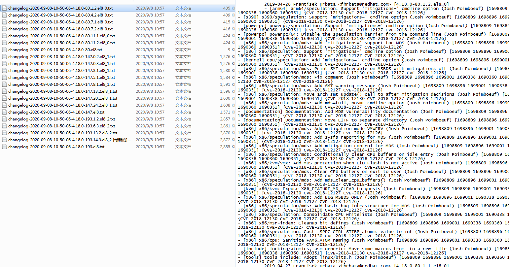
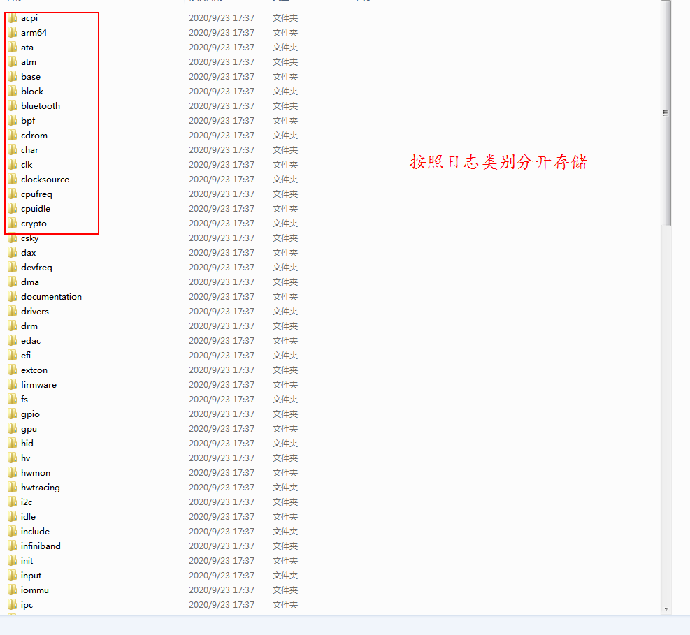
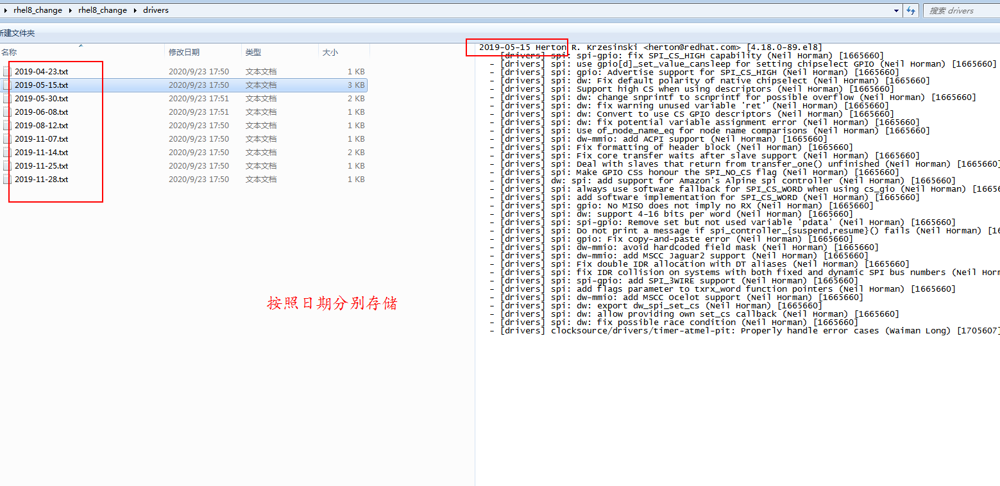

# RedHatCrawler
Data crawling RedHat's official website

本项目是爬取RedHat网站的rhel7 和rhel8的changelog，并按照日期及changelog中的类别分别存储。

爬取结果如下：

未经处理的日志内容和官方网站的一致。

执行 analyse_data.py 脚本，将上述changelog数据按照更新日期、类别分别存储，结果如下：

按照日期分别存储:

